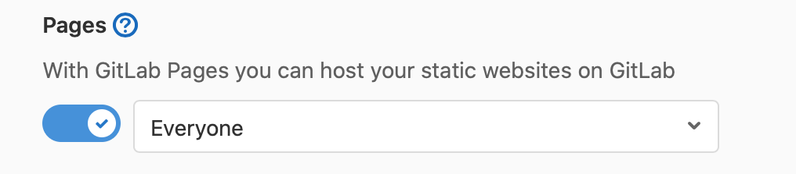

#### Установка HUGO, создаем сайта на локальной машине и подготовка GitLab
Установка
```bash
brew install hugo
```

Создание сайта
```bash
hugo new site ./имяСайта
```

Потом на [Gitlab](https://gitlab.com) необходимо создать репозиторий "имяСайта"

Еще нужно создать ssh ключ, чтобы легче было жить...

```bash
ssh-keygen -t ed25519 -C "комментарий"
```

Создатеся 2 файла, в одном публичный ключ, в другом приватный. Тот, что публичный заканчивается на pub (public). Его надо открыть и добавить на [github](https://gitlab.com/-/profile/keys) без комментария, в заголовке(тот что Title) указать например "домашний пека", можно еще задать когда этот ключ придет в негодность(по-хорошему), но для упрощения оставим пустым.

#### Теперь переходим к соединению папки на локальном компьютере и gitlab rep

```bash
cd ~/имяСайта
git init
git add *
git commit -m 'initial commit'
```

Темы для сайта можно найти здесь https://themes.gohugo.io/

На примере темы с этого сайта:

```bash
cd themes/
git submodule add https://github.com/vividvilla/ezhil.git ezhil
cd ..
git add *
git commit -m 'Added theme ezhil'
```

Теперь скопируем пример сайта который есть в самой теме:

```bash
cp -r themes/ezhil/exampleSite/* ./
git add *
git commit -m 'Added example of theme'
```

Все ли работает? Проверить это можно запустив локальный сервер, в Hugo это далается так:

```bash
hugo server -D
```

флаг `-D` означает лишь то, что загрузятся И черновые статьи, если они есть. В данном случае это не принципиально, так как в примере нет черновых статей.

Если все сработало так как мы этого ожидали - то остается загрузить все это в наш гит-репозиторий.

```bash
git push -u git@gitlab.com:Ваше_Имя_На_Гитлаб/Имя_проекта.git
git push -u git@gitlab.com:Ваше_Имя_На_Гитлаб/Имя_проекта.git master
```

Хорошо бы, чтобы наш Hugo не обновлялся постоянно в репорзитории, чтобы не приходилось все заново настраивать, поэтому заранее посмотрим версию на локальном компьютере с помощью команды `hugo version`, и эту версию мы будем использовать далее.

***вариант 1:*** в папке с нашим проектом на локальном компьютере нужно создать файл `.gitlab-ci.yml` с таким содержанием:

```yaml
# All available Hugo versions are listed here:
# https://gitlab.com/pages/hugo/container_registry
image: registry.gitlab.com/pages/hugo/hugo_extended:1.01

variables:
  GIT_SUBMODULE_STRATEGY: recursive

test:
  script:
    - hugo
  except:
    - master

pages:
  script:
    - hugo
  artifacts:
    paths:
      - public
  only:
    - master
```

Вместо `1.01` необходимо вписать Вашу версию.

***вариант 2:*** создать этот файл с помощью Gitlab: Репозиторий->Файлы->Добавить файл->в этой директории Новый файл. Выбрать из шаблонов `.gitlab-ci.yml`и `Hugo`, сгенирируется файл который будет выглядеть как этот:

```yaml
# This file is a template, and might need editing before it works on your project.
---
# All available Hugo versions are listed here:
# https://gitlab.com/pages/hugo/container_registry
image: registry.gitlab.com/pages/hugo:latest

variables:
  GIT_SUBMODULE_STRATEGY: recursive

test:
  script:
    - hugo
  except:
    - master

pages:
  script:
    - hugo
  artifacts:
    paths:
      - public
  only:
    - master
```

Я все же рекомендую отредактировать строку `image: registry.gitlab.com/pages/hugo:latest` и заменить в ней версию Hugo на статичную, `image: registry.gitlab.com/pages/hugo/hugo_extended:Ваша_Версия`

### Настройки репозитория

На [Gitlab](https://gitlab.com) в Настройки->Основные->Видимость... разверните и пролистайте вниз до Pages, где необходимо сменить "Только участникам проекта" на "Все"




Далее в Настройки->Страницы появится (вот-вот, не сразу) адрес вашего сайта на gitlab.

Так же можно добавить другое доменное имя. Если вы добавите стороннее доменное имя и верифицируете (никогда **НЕ удаляйте** его).

## Оживляем сайт

Для начала необходимо отредактировать основной конфиг сайта, а это `~/имяСайта/config.toml` и в первую очередь надо изменить `baseURL`

```toml
baseURL = "https://ваше_имя_на_гитлаб.gitlab.io/имя_проекта/"
```

Через несколько минут когда закончится сборка, можно будет заглянуть на сайт во внешнем мире как раз таки по адресу указанному в baseURL ;)

Останется только настроаивать сам сайт добавляя и убирая меню, можно даже изменить тему(ее цветовую гамму либо вообще создать свою).